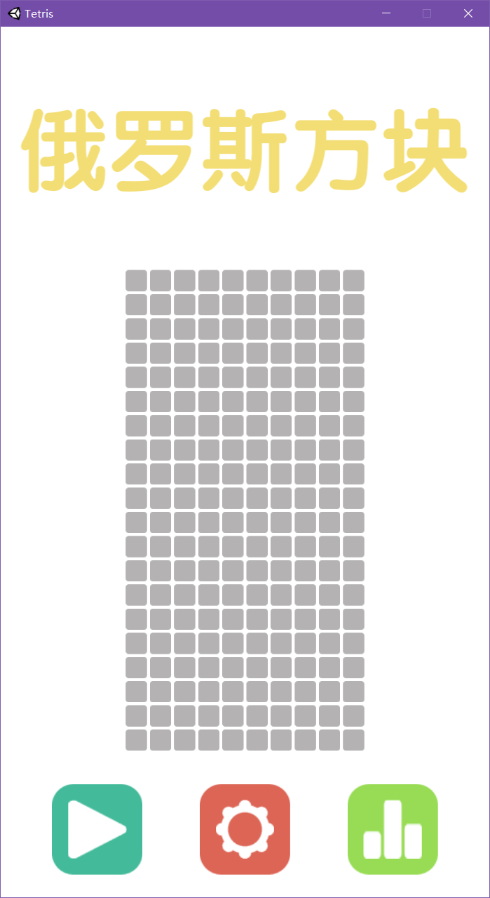
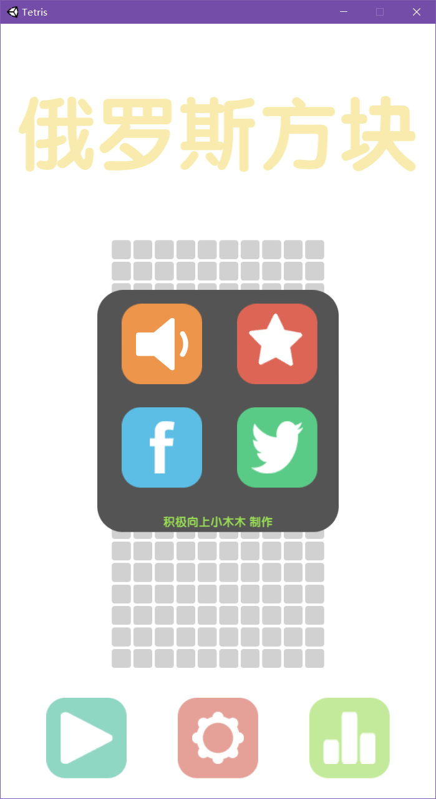
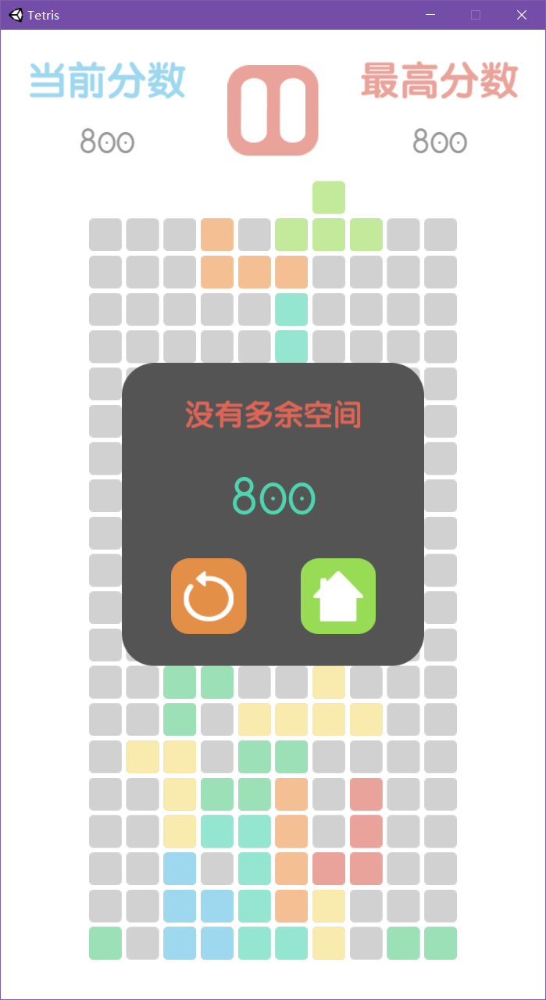
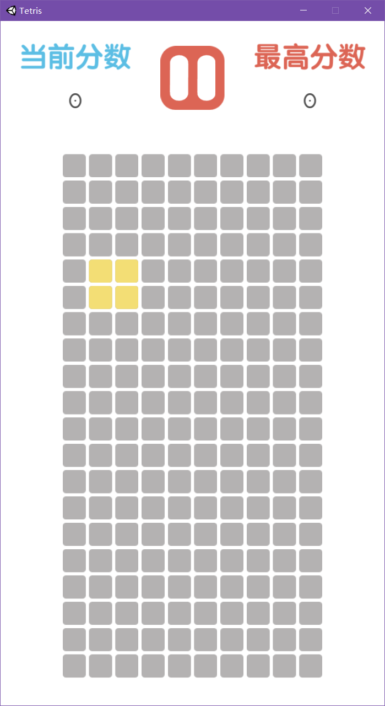
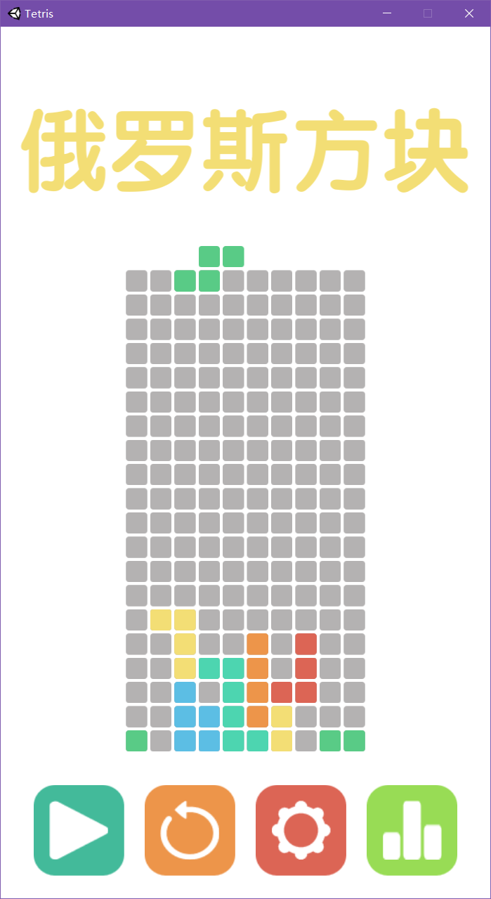
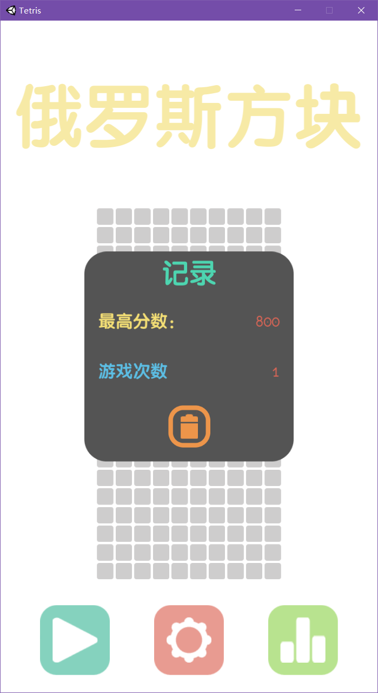
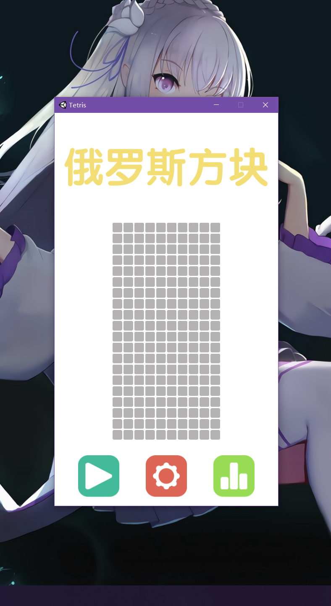
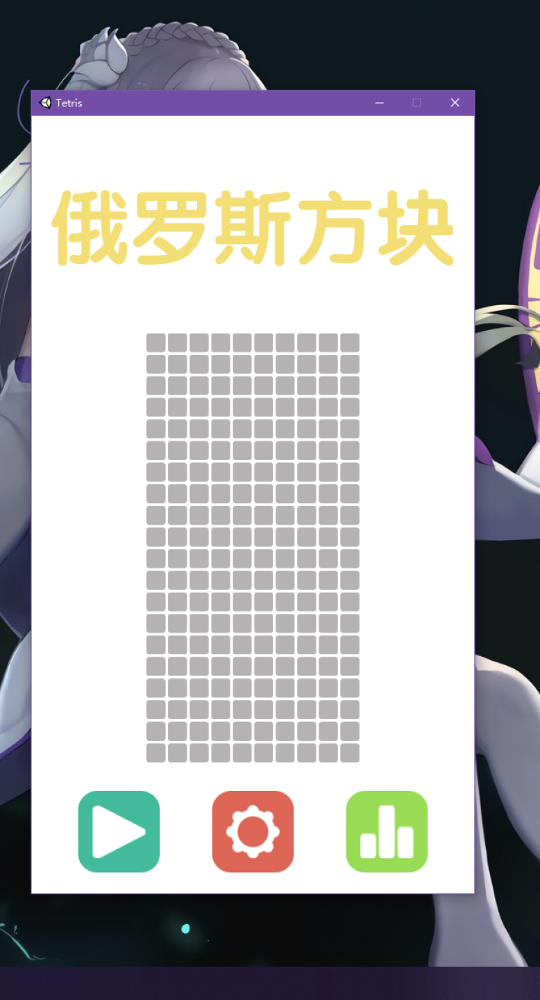
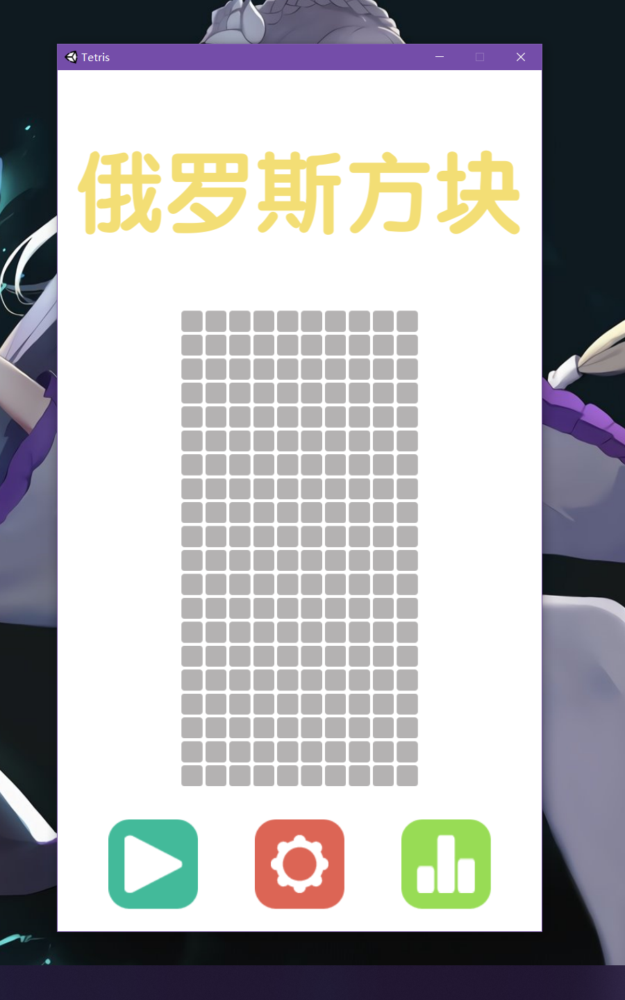
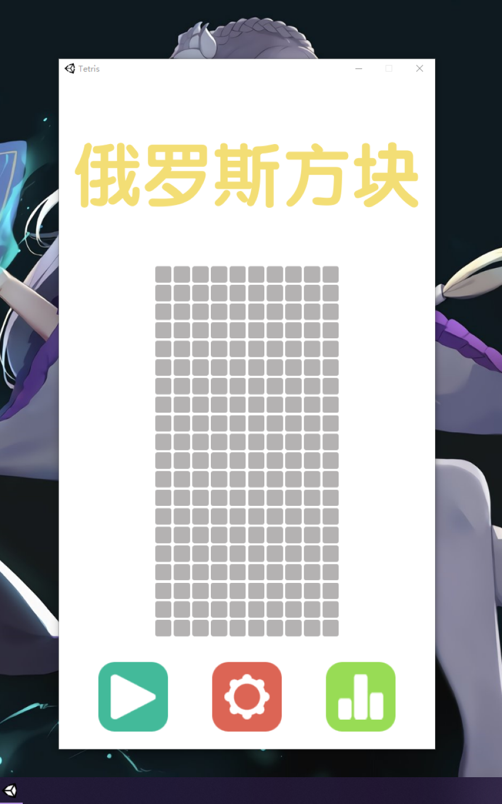

# 俄罗斯方块

**作者：积极向上小木木 &nbsp;&nbsp;&nbsp;&nbsp;&nbsp;&nbsp;&nbsp; 联系方式：PositiveMumu@126.com**

本项目为复刻经典游戏《俄罗斯方块》，左右方向键控制移动，上方向键控制旋转，下方向键加速下落。

## 一、项目截图

<center class="half">
  
&nbsp;&nbsp;&nbsp;&nbsp;&nbsp;&nbsp;&nbsp;&nbsp;
</center>

<center class="half">
  
&nbsp;&nbsp;&nbsp;&nbsp;&nbsp;&nbsp;&nbsp;&nbsp;
</center>


## 二、项目介绍

### 1.项目框架

- 本项目基于笔者自己封装的MVC框架开发，框架介绍参考[《框架介绍》](https://github.com/PositiveMumu/MFramework/blob/master/README.md)，在这里便不过多赘述。
- 项目使用DoTween插件来完成UI及非UI元素的动画效果。

同时任何项目的开发都不局限于一种框架，读者也可以参考本项目实现游戏流程思路，用自己擅长的方式来实现本项目。

### 2. 项目实现思路

#### MVC部分

根据MVC框架的结构，我们要将游戏划分成三个部分：存储并操作数据的Model层、展示游戏物体并接收玩家输入的View层、以及传递消息的Controller层。

根据对游戏的分析，具体划分如下：

1. 2个Model——GameDataModel（存储游戏运行中的数据）、MapModel（存储地图数据）。
2. 5个View——MenuView（游戏开始界面）、GameView（游戏界面）、SettingView（游戏设置界面）、TopListView（最高分界面）、LoseGameView（游戏失败界面）。
3. 若干Contrller，根据需要添加。

在View层中，GameView与LoseGameView可以合并，更准确的说LoseGameView是GameView的一部分。笔者在开发时并未考虑到这一点，读者在自行实现时可以尝试合并。

需要注意的是，View作为显示层的类，需要控制所有的能显示个玩家游戏物体，其中包括UI元素和非UI元素。所以实际上View这个“界面”并不是单纯的UI界面，而是一种逻辑界面。

在GameView中，既要展示UI信息，又要展示地图信息。所以在GameView中会持有二者的引用，游戏的主体逻辑也会在此完成（Update函数）。

#### 其他部分

1. GameRoot类，游戏入口，用来适配屏幕分辨率、注册游戏开始Controller、并出发游戏开始事件。
2. AudioManager，音频管理类，主要用以播放背景音乐和音效。
3. Consts，静态类，存储的常量。例如View的名称，事件名称（EventName）等。
4. Shape，方块基类，用来存储方块基本信息并提供初始化方块方法。
5. GameTools，游戏工具类。

#### 通信流程

在这里简单描述一下事件执行流程，具体其他流程可以参考项目代码。

以在MenuView点击开始新游戏按钮进GameView开始游戏为例：

1. 执行点击按钮方法——播放退出MenuView动画并发送“进入GameView”事件。
2. 监听了“进入GameView”事件的GameView响应该事件，获得两个数据模型的引用、播放进入动画并判断进入标志为true（true-开始新游戏，false-继续游戏）。
3. GameView发送“开始新游戏”事件，GameBeginController响应该事件，并调用GameDataModel和MapModel执行对应方法。
4. GameDataModel清空上局残留信息，并将游戏状态置为游戏中。MapModel清空地图并将暂停状态置为未暂停。
5. GameView中Update方法里面的游戏逻辑检测到游戏已开始并且未暂停，开始生成第一个方块，游戏开始。


- - -

可以看到在4到5过程中，Model层改变数据，并未通知View层，View层便可以拿到数据，原因有两个：

- 在进入GameView获得了数据模型的引用，当数据模型改变时，View中的引用会随着改变。
- GameView中的游戏逻辑处在Update函数，被不断调用。当Model层改变数据后，GameView层会立马检测到改变，相当于完成的通知。

在TopListView点击清空本地书按钮时，虽然数据模型发生改变（TopListView中引用的数据模型也随之改变），但是因为TopListViewUI显示逻辑并未被一直调用，所以TopListView无法及时检测改变。这时便需要模型做出通知。（（。））

具体可参考实现监听者模式的两种方法：

1. 监听者不断查询被监听者状态是否改变。

2. 被监听者通知监听者状态改变。


## 三、游戏运行分辨率适配

游戏的设计分辨率为1080*1920。一般在制定设计分辨率时，设置一个较小的分辨率然后向大分辨率适配是我们的思路。但本项目在刚开始时计划的是手机游戏，所以设置分辨率略高。

但是该部分所说的分辨率适配并不是上述意义的分辨率适配。因为游戏是一个竖屏游戏，在打包时我们一般选用窗口运行的方式。但是在Unity中只能设置一个默认的分辨率，当游戏运行在不同分辨率的屏幕上时展现的效果时不同的。

<center class="half">
  
&nbsp;&nbsp;&nbsp;&nbsp;&nbsp;&nbsp;&nbsp;
</center>

左边是2K分辨率的屏幕，右边是1080P的屏幕。可以看到，利用Unity打包设置中的分辨率设置，在不同分辨率的屏幕下展示的效果是不同的。也就意味着设置的分辨率是死的。

而我们希望可以实现根据屏幕的分辨率窗口适配，也就是说在2K和1080P分辨率下窗口的大小是固定的。

在Unity中，我们可以拿到当前显示器的分辨率（注意不是窗口的宽高，而是屏幕的分辨率）。我们的设计分辨率为1080*1920。则可以针对屏幕做适配：

```C#
int width = 1080 * (Screen.currentResolution.height - 200) / 1920;
int height = Screen.currentResolution.height - 200;
Screen.SetResolution(width, height, false);
```

这样在不同分辨率的显示器下，看到的窗口大小都是一样的（即使当前显示器的分辨率不是建议分辨率）。

<center class="half">
  
&nbsp;&nbsp;&nbsp;&nbsp;&nbsp;&nbsp;&nbsp;
</center>


左边是2K分辨率的屏幕，右边是1080P的屏幕。看到的误差是因为将1080P的图片放大到了与2K图片一样的尺寸。

注意观察，两张图片中窗口的上边界在头顶的花处，窗口的下边界在腿弯处。对比未适配前的图，可以明显的看到变化。

但也可以发现，两者的下边界似乎不在一个位置。这是因为在适配分辨率时，并未让窗口的高度等于显示器分辨率的高度，而是留出了200像素的高度。

注意，这里的200像素是个固定值，这也就是为什么即使适配后虽然窗口大小都差不多，但是好像还是有一些差距。

如果将这个值改为一个比例，例如留出屏幕分辨率高度的10%，那么两者的效果将会完全相同。读者可以自行验证。


